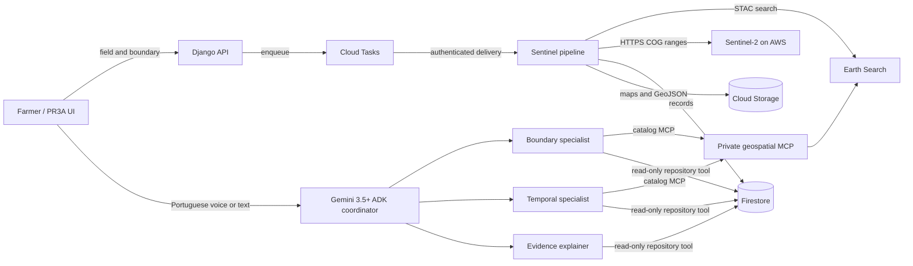

# 1415 Agri architecture

## Product boundary

The MVP helps a farmer delimit one field, compare its development through time, and see a
small number of internally different zones. It does not diagnose pests, diseases, soil
deficiencies, or irrigation needs. The output is evidence for field inspection and local
agronomic judgment.

Earth Search is the public STAC catalog, Element 84 maintains that catalog API, and the
Sentinel-2 Cloud Optimized GeoTIFF assets are served from AWS open data. The code keeps these
roles explicit rather than describing every component as “Copernicus”.

## Deterministic geospatial pipeline

1. Search Sentinel-2 L2A scenes intersecting the confirmed field and time window.
2. Prefer sufficiently clear observations and retain alternate tiles/scenes for fallback.
3. Read only bounded COG windows for B04, B05, B08, B11, and SCL.
4. Apply the STAC-provided scale and offset to convert stored values to reflectance.
5. Reproject every band and observation onto one canonical B04 grid.
6. Mask invalid, cloud, shadow, cirrus, snow, and no-data pixels using SCL.
7. Calculate NDVI, NDRE, and NDMI; summarize their temporal behavior per pixel.
8. Cluster valid pixels deterministically into 2-7 spatially smoothed zones and persist exact
   GeoJSON evidence plus lightweight SVG previews.

The algorithms make the measurements and zone assignment. Gemini does not fabricate spectral
values or redraw the map; it selects read-only tools and explains stored evidence in language
appropriate to the farmer.

## ADK agents

- **Coordinator:** understands the farmer's request and delegates to the narrow specialist.
- **Boundary specialist:** explains the proposed outline and asks for confirmation when needed.
- **Temporal specialist:** retrieves observations, indices, zone summaries, and processing
  limitations.
- **Evidence explainer:** turns technical evidence into a short PT-BR explanation while
  explicitly avoiding agronomic diagnosis.

Sentinel-2's red-edge, near-infrared, and short-wave infrared bands (B05, B08, and B11) measure
wavelengths outside normal human vision. The defensible claim is therefore: **the satellite
measures signals the eye cannot see, the deterministic pipeline quantifies them, and Gemini
makes that evidence understandable and actionable for inspection.**

## Security boundaries

- The public web service requires the demonstration session for agricultural APIs.
- Cloud Tasks calls the worker with OIDC plus an application-level shared secret.
- The MCP and ADK Cloud Run services must require IAM authentication; neither should be public.
- MCP catalog tools and repository evidence tools are allowlisted and read-only. Remote imagery
  access is HTTPS-only with an exact
  host allowlist, bounded windows, timeouts, and retry limits.
- Secrets belong in Secret Manager. Service accounts receive only the Firestore, Storage,
  Tasks, Vertex AI, and private-service invocation permissions required by their role.

## Main implementation entry points

- `geospatial/earth_search.py`: STAC catalog and asset calibration metadata.
- `geospatial/cog.py`: bounded, aligned, calibrated raster reads.
- `geospatial/boundary_service.py`: Sentinel-backed field-outline suggestions.
- `geospatial/pipeline.py`: asynchronous temporal analysis and artifacts.
- `geospatial/mcp_server.py`: read-only MCP boundary.
- `agentic_agriculture/agent.py`: ADK graph.
- `agentic_agriculture/prompts.py`: PT-BR behavior and scientific guardrails.
