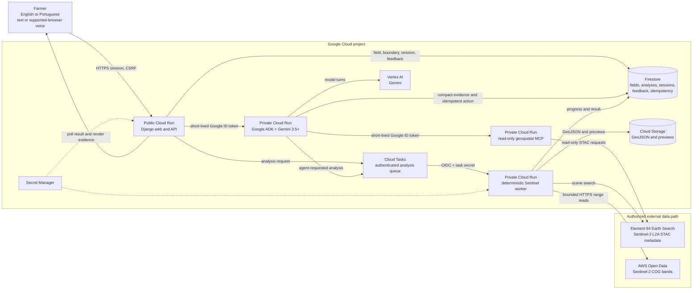

# Architecture narrative

## Design thesis

Agentic Agriculture is designed around one strict boundary:

> Gemini decides how to guide the farmer and which safe tool to use; deterministic software decides
> what the satellite pixels measure.

This separation makes the project both agentic and auditable. Gemini 3.5+ can lead the workflow,
request a real analysis, retrieve exact evidence, and translate it into a field-inspection step. It
cannot invent a scene, alter a reflectance value, redraw a polygon, or convert spectral variation into
an agronomic diagnosis.

The system is deployed as four independently permissioned Cloud Run roles. This is deliberate rather
than cosmetic: public interaction, model reasoning, catalog tools, and long-running raster processing
have different trust, resource, and failure boundaries.

## System diagram

## End-to-end action flow

### 1. Establish trusted field context

The farmer supplies a crop, season, estimated area, and one reference location. The Django API stores
a typed `Field` record. The boundary service searches within the stated season, attempts clear
Sentinel-2 observations with all required bands, and proposes a polygon. If imagery is temporarily
unavailable or unsuitable, it returns an explicitly labeled editable geometric fallback rather than
pretending that the pixels produced a confident result.

The polygon is not authoritative yet. The farmer can drag vertices or edit coordinates and must
explicitly confirm it. Analysis requests for an unconfirmed field are rejected.

### 2. Create a safe asynchronous action

An analysis may be requested through the web workflow or, after explicit user intent, by the ADK
temporal specialist. The agent action first retrieves the current field, verifies the confirmed
boundary, validates the requested two-to-seven zone range, and derives an idempotency key from the
field identifier, last update time, and requested zone count.

The application writes a queued `Analysis` record and sends a task to Cloud Tasks. A repeated browser
request, model retry, or network retry either replays the original result or detects a conflicting
body; it does not silently create duplicate analyses.

### 3. Acquire real observations without moving pixels through Gemini

Cloud Tasks calls the private worker with a short-lived OIDC token and an application task secret. The
worker queries the Earth Search STAC catalog for Sentinel-2 L2A scenes intersecting the confirmed
field and crop-season interval. Adjacent tiles acquired on the same date are treated as coverage
alternatives rather than independent temporal observations.

For each usable date, the worker reads only the field-bounded Cloud Optimized GeoTIFF windows for:

- B04 — red;
- B05 — vegetation red edge;
- B08 — near-infrared;
- B11 — short-wave infrared;
- SCL — scene classification used for quality masking.

The catalog-provided scale and offset are applied, and every band/date is reprojected onto one
canonical B04 grid. Invalid, no-data, cloud, shadow, cirrus, and snow classes are masked. The worker
requires at least two complete, aligned temporal observations.

Only metadata and compact summaries are available to the agent. Raster arrays stay inside the
worker's bounded memory and never enter an LLM prompt or MCP response.

### 4. Transform observations into auditable evidence

The worker calculates three normalized-difference indices:

- NDVI from near-infrared and red;
- NDRE from near-infrared and red edge;
- NDMI from near-infrared and short-wave infrared.

It builds a time-major feature vector for every usable field pixel, uses robust median/interquartile
scaling, and includes a modest spatial coordinate weight. K-means is seeded for reproducibility. When
the farmer has not requested a fixed count, candidates from two to seven zones are evaluated with a
silhouette measure, a fragmentation penalty, minimum pixel support, and a simplicity penalty. Small
isolated components are spatially smoothed. Zone identifiers are then ordered by aggregate relative
signal rather than by an unstable cluster label.

The result contains exact scene IDs, acquisition timestamps, cloud cover, field-level index values,
zone trajectories, area, geometry, selection rationale, quality measures, processing scope, source
metadata, and artifact URIs. Firestore stores the state and evidence; Cloud Storage stores lightweight
previews and GeoJSON.

The output is explicitly `relative_spatial_variability_only` and `diagnostic: false`.

### 5. Let Gemini lead without overriding the evidence

The Django service creates an agent session tied to trusted server-side field and analysis IDs. The
browser never receives the private ADK origin or a Google identity token. Django calls the private ADK
service and returns only the final plain-text answer plus a compact trace of model, agent, and tool
names.

The Google ADK graph contains:

- **agriculture coordinator** — understands the request, asks at most one clarification at a time, and
  delegates;
- **boundary specialist** — explains a proposal and requires farmer confirmation;
- **temporal-analysis specialist** — discovers observations, can request an idempotent analysis,
  follows its status, and compares stored trajectories;
- **evidence explainer** — translates exact analysis or zone evidence without adding causal claims.

The boundary and temporal specialists receive allowlisted MCP tools for real scene search, scene
lookup, and observation planning. Repository tools expose small typed envelopes for field, analysis,
and zone evidence. The action tool is intentionally separate from read tools and narrow enough to
audit.

### 6. Adapt under farmer control

The farmer can correct the geometry before processing, choose another grouping from two to seven
zones, ask follow-up questions in the same field/analysis context, and record a helpful, unclear, or
not-helpful rating. Feedback includes the analysis and session identifiers and can optionally identify
a zone.

The current submission persists that feedback but does not claim automatic retraining or online
weight updates. Adaptation in the running product is explicit and inspectable: context, correction,
re-grouping, clarification, and follow-up tools change the interaction without rewriting the measured
evidence.

## Why the data architecture fits Collaborative Partner

The official architecture subcriterion for this track is labeled **The Evolving Knowledge Engine**.
An official Devpost manager confirmed that this label maps to Collaborative Partner. The project
addresses its data-architecture and context-efficiency questions in three ways:

1. **Typed state instead of prompt memory.** Fields, analyses, zones, sessions, feedback, progress,
   provenance, and idempotency records have strict versioned schemas in Firestore.
2. **Evidence projection instead of raw context.** Pixel arrays remain in the worker. Agent tools emit
   only the records needed for one decision, and list calls are bounded.
3. **No unnecessary vector database.** The evidence is already structured by exact field, analysis,
   zone, and scene identifiers. Embedding coordinates and spectral numbers would make retrieval less
   exact and add an unjustified subsystem. Direct typed lookup is the disciplined design for this
   workload.

## Failure tolerance and safety boundaries

| Risk | Implemented control |
| --- | --- |
| Duplicate browser, agent, or task delivery | Atomic idempotency records and deterministic agent-action keys |
| Worker termination during a long analysis | Cloud Tasks retry policy plus a time-bounded processing lease |
| Cloudy or incomplete scene | SCL masking, alternate tile/date attempts, minimum-observation checks |
| Catalog or imagery failure during boundary suggestion | Explicit low-confidence editable fallback with reason metadata |
| Model hallucination | Read-only evidence projections, allowlisted MCP tools, deterministic numeric pipeline, hard prompt limits |
| Unconfirmed or imaginary geometry | Analysis blocked until farmer confirmation; model never generates coordinates from memory |
| Private-service exposure | Separate identities, Cloud Run invoker IAM, short-lived ID tokens, no service-account JSON keys |
| Excess cost or resource contention | Scale to zero, bounded maximum instances, one concurrent Sentinel task, budget alerts |
| Oversized or hostile web request | Authenticated API, CSRF, body limits, strict contracts, escaped plain-text agent output |

## Google technology map

| Contest requirement or capability | Implementation |
| --- | --- |
| Gemini 3.5 or newer | Gemini model through Vertex AI in the private ADK service |
| Google agent framework | Google ADK coordinator, specialists, tools, sessions, and event traces |
| Google Cloud infrastructure | Cloud Run, Firestore, Cloud Storage, Cloud Tasks, Secret Manager, Artifact Registry, Cloud Build |
| Agent takes action | `request_field_analysis` validates, persists, and enqueues an analysis |
| Agent/tool interoperability | Private Streamable HTTP MCP service with three allowlisted catalog tools |
| Feedback capture | Typed feedback persisted against analysis and ADK-backed session |
| Proof and reproducibility | Docker image, idempotent GCP scripts, smoke suite, preflight command, automated tests |

## Validation status

A local real-data pipeline run was observed at approximately 42 seconds with three real scenes and
two relative-development zones. The ADK/Gemini/MCP route has also functioned in local validation.
These facts demonstrate technical feasibility but remain **local validation** until the final hosted
run produces a matching persisted manifest and video evidence. They are not accuracy, diagnosis,
generalization, or production-latency claims.

## Source references

### Contest

- [All Things Agentic official rules](https://allthingsagentichackathon.devpost.com/rules)
- [All Things Agentic official overview](https://allthingsagentichackathon.devpost.com/)
- [Official Devpost manager clarification of category-to-subcriterion mapping](https://allthingsagentichackathon.devpost.com/forum_topics/44900-rules-track-names-multi-agent-nexus-etc-vs-official-categories-which-applies-to-fleet)

### Technology and data

- [Google Cloud: service-to-service authentication for Cloud Run](https://cloud.google.com/run/docs/authenticating/service-to-service)
- [Google Cloud: authenticated HTTP targets in Cloud Tasks](https://cloud.google.com/tasks/docs/creating-http-target-tasks)
- [Google Cloud: Firestore database management](https://cloud.google.com/firestore/docs/manage-databases)
- [Google Codelabs: building agents with ADK](https://codelabs.developers.google.com/devsite/codelabs/build-agents-with-adk-foundation)
- [AWS Registry of Open Data: Sentinel-2 L2A Cloud-Optimized GeoTIFFs](https://registry.opendata.aws/sentinel-2-l2a-cogs/)
- [ESA: Sentinel-2 multispectral instrument](https://www.esa.int/Our_Activities/Observing_the_Earth/Copernicus/Sentinel-2/Instrument)
